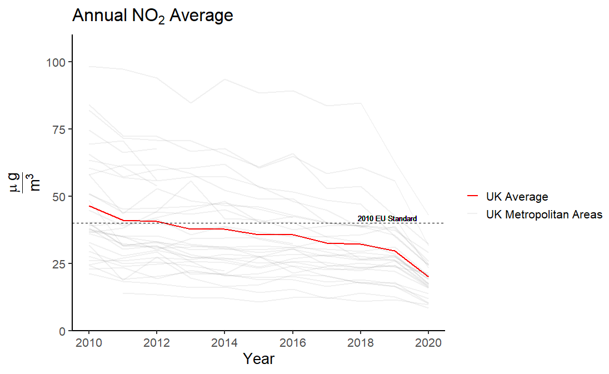
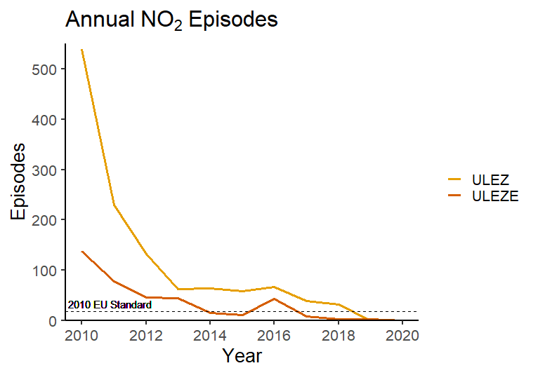
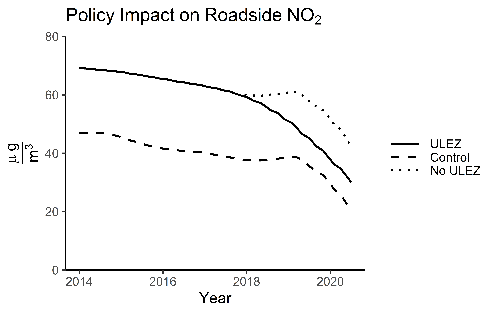

## Introduction
This blog post aims to explore the impact of the Ultra Low Emission Zone (ULEZ) on air pollution in London. Official reports on the impact of the ULEZ simply looked at the difference between emission in the affected area and the outskirts of Greater London. Due to potential spatial spillovers from the policy, I looked at re-estimating the results by using a synthetic control group based on other metropolitan areas in the United Kingdom. The results indicate that emission reductions from the ULEZ are around 40%, or 9% higher than the official estimates made by the Mayor of London.

## Background
In 2017 it was estimated that air pollution in London was costing the healthcare system upwards of £3.7 billion per year and resulting in 9,400 premature deaths ([London Councils, 2017](https://www.londoncouncils.gov.uk/node/33224)). Air pollution has also been found to significantly increase crime, and impair cognition ([Bondy, Roth, and Sage, 2012](https://www.journals.uchicago.edu/doi/full/10.1086/707127); [Fonken et al., 2011](https://www.nature.com/articles/mp201176)). In addition to the widespread health and societal issues, reductions in emissions from road transport will play a vital role in achieving net-zero by 2050 ([UNFCCC, 2018](https://unfccc.int/sites/default/files/resource/328_TransportDecarbonizationToolbox_TalanoaDialog.pdf)).

NO$_2$ has been a particularly large problem in the United Kingdom, with many urban areas failing to meet the 2010 target of 40$\frac{\mu g}{m^3}$ per year.

{width=80%}

As of July 2020, NO$_2$ levels were still above the target emissions set by the European Union for 2010. It wasn't until 2019 that the area of London which is now covered by the ULEZ was able to bring the number of annual NO$_2$ episodes in line with the 2010 targets, where one NO$_2$ episode is classified as a 24 hour period where the average air pollution levels are above 50$\frac{\mu g}{m^3}$.

{width=80%} 

In an attempt to combat the rising air pollution, a Toxicity-Charge (T-Charge) was imposed in Central London in 2017. The policy applied a £10 charge to any vehicle which was registered before 2006 which travelled through the London congestion zone. Two months later on the 1st of January, 2018, the transition towards an Ultra Low Emission Zone (ULEZ) started. From the start of the transition period, all new taxis and private hire vehicles should be zero emission capable. On the 8th of April, 2019, the ULEZ replaced the T-Charge, imposing a £12.50 charge for most existing vehicles, and £100 for heavy vehicles. As of the 25th of October 2021, there will be a new Ultra Low Emission Zone Expansion (ULEZE), which will extend to London's North and South circular roads.

## How do we calculate the impact?
One of the main difficulties when assessing the efficacy of emission zoning policy is the ability to find a suitable control group. Due to spatial spillovers, regions within close proximity to where the policy was enacted are often indirectly impacted by the policy. Consequently, comparing the changes in emissions between an effected area compared to surrounding areas will likely lead to biased estimates.

Another way to think of these spillovers is to consider what happens when a rock(policy) is thrown in a lake. When the rock hits the water it creates a large initial splash(treatment effect), and ripples(spillovers) follow. The further we move away from where the rock landed, the smaller the ripples will become. Consequently, if we are interested in measuring the height of the splash relative to the normal level of the lake, we want to compare the size of the splash to another area far away from where the rock landed. Note that if we chose a location which was too close, we may observe a value which is either at the peak or trough of the ripples, hence biasing our estimates. Furthermore, we also need to make sure that there were no other rocks thrown in the lake at the point we are using as our comparison point, as this would also lead to skewed results.

What this means for assessing the policy efficacy is that we would want to find a control group which is highly unlikely to be affected by the policy, but hopefully still follow the same path as the affected area if the policy was not put in place. A common way for checking whether our control group is likely to follow the same path as our treatment in the absence of the policy, is by checking whether they had parallel trends prior to the policy intervention. Looking at the change in the difference between these two groups before and after the policy implementation, we can get an indication of the average treatment effect.

## Impact of the zoning policies
In order to assess the change in air pollution, daily air pollution data from 150 Automatic Urban and Rural Network (AURN) sites all over the UK were analysed. Air pollution values were then deseasonalised and aggregated at a monthly rate. The data provides reasonable estimates of air pollution for 28 metropolitan areas. Taking a weighted average of other metropolitan areas in the United Kingdom, we can create a "synthetic" control group which satisfy the parallel trend assumption. In an effort to minimise the spatial spillovers Greater London and neighbouring counties were excluded. Furthermore, any metropolitan areas which implemented policies to reduce air pollution between 2010 and July 2021 were also excluded as potential control groups. Although we can never be certain that there are no spillovers, by only selecting metropolitan areas which are outside of a reasonable commuting time to the ULEZ, the spillovers are hopefully minimised.

the Mayor of London released two reports [[2019](https://www.london.gov.uk/sites/default/files/ulez_six_month_evaluation_report_final_oct.pdf), [2020](https://www.london.gov.uk/sites/default/files/ulez_ten_month_evaluation_report_23_april_2020.pdf)] summarising the impact of the ULEZ on air pollution, and concluded that the zoning policy reduced roadside NO$_2$ by 31% and 37% respectively in the two reports. The reports measured changes in roadside levels between ULEZ monitoring stations and monitoring stations located at the periphery of Greater London. Comparing the results from the latest report from the Mayor of London to the results from the synthetic control method indicates the policy was effective at reducing roadside NO$_2$ emission by 40.5% as of January 2020.

The sharp fall seen in the control group in 2019 can be observed in almost all metropolitan areas. This drop was likely due to the unveil of the [Clean Air Strategy](https://www.gov.uk/government/publications/clean-air-strategy-2019/clean-air-strategy-2019-executive-summary) which laid out a plan for reducing air pollution in the UK by 2020 and 2030.

## Concluding remarks
The purpose of this blog post was to explore the use of synthetic controls in a spatial setting, looking at a case-study of the emission zoning policies in London. After accounting for spatial spillovers, it is likely that the Ultra Low Emission Zone reduced emissions in Central London by up to 40.5%, which is 9% greater than the official estimates by the Mayor of London.

This being said, the analysis is far from perfect. Firstly, in the data there are only 150 monitoring stations, this means that the number of monitoring stations per metropolitan area is very low. Consequently, the air pollution data may not accurately represent all metropolitan areas. Secondly, caution should be exercised when interpreting these results as causal. The parallel trend assumption did not hold for any other air pollutants than NO$_2$. One explanation from this is that using other metropolitan areas in the UK as a control group may not be a good representation of London, as it is often viewed as its own microcosm within the UK.

To conclude, I would say that the results do indicate that that the ULEZ was effective in reducing NO$_2$ concentrations in Central London. Furthermore, the results imply that the effect may be greater than official estimates due to spatial spillovers. With the Expansion of the ULEZ in October 2021, it will be exciting to see the impact on urban air pollution. Luckily, it does seem like we are moving towards greener and cleaner urban spaces.
