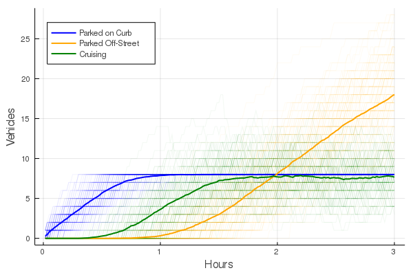
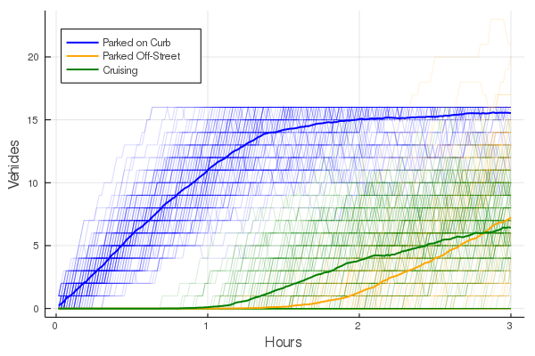

## Introduction
Cruising for parking may seem to be an innocent act, however its mere existence stems from misaligned incentives. An individual will only cruise given that they value their time & fuel cost less than potential savings from parking off-street (parking garage/lot). The individual agent is unlikely to take into account the impact which their cruising has on other road users, in terms of congestion, or the extra fuel emissions caused. Although this may seem somewhat trite, Donald Shoup ([2006](https://www.researchgate.net/publication/222745846_Cruising_for_parking)) presents a model which aims to bring to light the extent which these negative externalities can reach.

Aligning the price of curb-side parking and off-street parking generally removes the incentive to cruise. Furthermore, as the curb-side prices are often regulated according to the local departments of transportation, revenues can be collected by increasing the curb-side prices. This creates a potential triple-dividend, where increases in curb-side parking can reduce emissions and congestion at the same time as raising revenues for the government which can be used to offset other distortionary taxes. This post will follow Shoup's model, based on the julia implementation which you can find over on my [github](https://github.com/FinnHB/JuliaProjects/tree/main/ParkingSimulation). For a more detailed overview of the modelling, the github repository contains an interactive notebook which discusses the model implementation.

## Brief overview of the model
For the sake of brevity, I will only briefly cover the model, and conveniently, there is only one equation to discuss:

$c^* = \frac{t(m-p)}{f+nv}$

In the above equation, $t$ is the desired parking duration in hours, $m$ is the hourly price of off-street parking, and $p$ is the hourly price of parking on the curb. This makes the numerator on the right hand side the potential savings from parking on the curb contra parking off-street. $f$, $v$, and $n$ are the hourly fuel cost, hourly value of time, and the number of people in the car respectively. This means that the denominator represents the hourly cost one incurs from cruising. Resultantly, $c^*$ is the maximum amount of time which an agent is willing to cruise for.

## The baseline case
Based on this one equation, one can easily start to think of different policy tools which could be used to the incentive to cruise. Using the price levels for downtown Chicago, where $p=\$1.00$ and $m=\$13.25$, and assuming a hourly value of time centered around $\$25$ with a fuel cost of $\$0.74$, we can simulate the extent of cruising. Using a similar example to the paper, where we assume that there are 8 available parking spaces, we get the following scenario:

{width=80%}
First, the available curb-side parking fills up (blue line). Once all the curb-side spaces have been occupied, agents start to cruise to see if an availability opens up (green line). Eventually, when some agents have cruised for their $c*$ amount of time, they will decide to park off-street (yellow line). Over time, as agents leave from the curb-side parking, they immediately get occupied with the cruisers, meaning that curb-side parking is constantly at full capacity.

We can also see a plateauing of the number of agents who are cruising for parking at around 8. In this scenario, a total of 109 km were cruised during the 3 hour time-frame, assuming a coasting speed of 8km/h. Based on the emissions of a 2020 Honda Civic, this would have amounted to approximately 13kg of CO$_2$ emissions and 15g of NO$_x$.

## Increasing parking availability
What may seem like an obvious answer, is to increase the amount of curbside parking availability. Ignoring limitations to increasing desirable curb-side parking, increasing the amount of available parking may result in temporarily alleviating the amount of cruising.

{width=80%}

Doubling the amount of available curb-side parking space from 8 to 16 has an immediate impact on the amount of cruising in the short term. Unfortunately, the same story as before repeats itself. As soon as the available curb-side parking has been occupied, the cruising persists, returning to the same stable point of approximately 8 agents cruising for parking. That being said, increasing the amount of available parking, can be an effective method of reducing coasting if the demand for parking is sufficiently low, and periods of high demand are sufficiently short.

## Price matching
By far the most efficient method of reducing the incentive to cruise is to align the price of parking on the curb versus the price of parking off-street.

## Time restrictions
Enforcing time restrictions on the amount of time allowed to park, increases the rate at which curbside locations become available. On the one hand, this may increase the likelihood of agents finding available parking increasing the incentive to cruise. On the other hand, it may act as a method of market segmentation, where agents who wish to park for longer durations no longer prefer parking on the curb. Unfortunately, this model is not apt at modelling such scenarios, and I'll just leave this here as some food for thought.

  
Feature image source: <a href="https://unsplash.com/photos/6QIefFMpHEY">www.unsplash.com</a>
 
