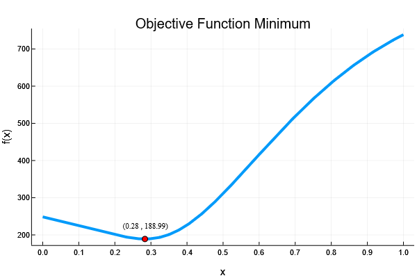
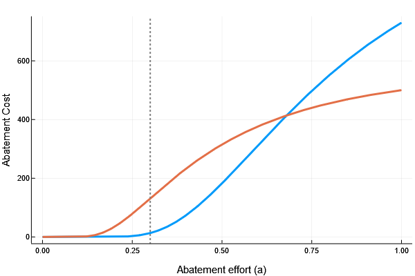

## Links to Resources
[Original Notebook (PDF)](https://github.com/FinnHB/JuliaProjects/blob/main/FirmChoice/firm_choice_notebook_I.pdf)

[Github Repo](https://github.com/FinnHB/JuliaProjects/tree/main/FirmChoice)


## Introduction
There are many ways which governments try to incentivise firms to reduce their CO$_2$ emissions. However, two of the most prominent methods are carbon taxes and permit schemes. With the latter sometimes being referred to as a 'cap-and-trade' system -- emissions are capped and firms trade the permits. When it comes to meeting emission targets, both methods can be effective tools.

This blog post will be focused on how one can analyse these two policies, specifically looking at an optimization framework. The motivation behind this is purely because I have recently had a bit of a personal fascination with how programming can be used to solve optimisation problems without resorting to [finite differences](https://en.wikipedia.org/wiki/Finite_difference); and what better example to use than taxes vs. permits?

I have tried to structure this somewhat differently from the original notebook, tailoring it slightly more to the blog-style format. As a result, the first section will give a very brief introduction to permits versus taxes. This will then be followed by two worked examples of using JuMP.jl (Julia for Mathematical Programming) to solve optimization problems -- one on taxes, and one on permits. These correspond to parts 1.a and 1.c of the notebook. Lastly there will be a conclusion, because, it wouldn't be a very good blog post if it didn't have a few reflections and take-aways.

<br>

## Background
#### Carbon tax -- pricing instrument
In the case of a carbon tax, a fixed carbon price is pre-determined by the policy maker and then firms need to pay in order to be allowed to pollute. The benefit of this is that firms have certainty surrounding the cost of polluting. Similarly, on the policy side, it is relatively easy to monitor and collect the taxes as the infrastructure is mostly in place. The main obstacle is that knowing what the "correct" carbon tax to set is very difficult. If the carbon tax is too low, then not enough CO$_2$ will be abated. If it is too high, then too much CO$_2$ will be abated, overburdening industries and thwarting the economy. From a climate-perspective, this means that a carbon tax doesn't provide us with any guarantee of whether we would reach our net-zero targets


#### Permit scheme -- quantity instrument
For permit schemes, a limited quantity of emission permits are allocated. Each permit corresponds to an allowable amount of a pollution which the a firm can legally emit. A firm can pollute more, or less, depending on the number of permits they hold. Furthermore, permits are tradable between firms, so if a firm has too many permits, it can choose to sell them at some market price. Since the permits correspond to a fixed quantity of pollution, a permit scheme ensures a known reduction in emissions, however, it does not guarantee a fixed price of CO$_2$. This means that a permit scheme may introduce some price uncertainty, as firms may not initially know what the permit price will be.

In short, permits are quantity instruments, since they limit the quantity of pollution, whereas taxes are price instruments, as they assign a fixed price to polluting.

<br>

## Solving optimisation problems
```{r setup, include=FALSE}
library("JuliaCall")
knitr::opts_chunk$set(
	warning = FALSE
)
julia <- JuliaCall::julia_setup(JULIA_HOME = "C:/Users/finn_/AppData/Local/Programs/Julia-1.7.2/bin")
```

Now that you are all caught up, lets jump in to the optimisation and solving for how a firm may behave under different scenarios. 

Before we start with the coding, we'll need to load the relevant packages. In this case, that's JuMP.jl for the optimisation and then Ipopt.jl, which is one of the more common solvers for JuMP. ForwardDiff.jl will also be used for the last question, however, it is not necessary for solving optimisation problems.
```{julia echo=TRUE, results='hide'}
using JuMP, Ipopt, ForwardDiff
```

For pragmatic reasons, I will only go through parts *1.a* and *1.c* from the notebook as they are the questions which relate to optimisation. Question *1.b* looks at calculations for the net-present value of costs. It is important, but unfortunately doesn't include any optimisation.


#### A firm's response to taxes
*Assume that a firm can produce $Q$ units of output at a cost of $0.2Q + Q^{\frac{1}{2}}$, where each unit of output generates 0.1 tCO$_2$. In 2025, the government will impose a carbon tax of €120 per tCO$_2$. However, the firm can also choose to abate a fraction, $a$, of their emissions at a cost of $730 \times a^{\frac{1}{a}}$ where $a \in [0,1]$*

*Once the tax comes in to effect, how much CO$_2$ will the firm emit and what will be the total annual cost of the carbon tax policy to the firm?*

<br>

To begin with, we write up the relevant equations as stated in the question, namely, the abatement cost and the production cost. As the firm will want to minimise their total cost, subject to the tax, we can also specify the objective function which we want to minimise.
```{julia echo=TRUE, results='hide'}
#Abatement cost function
f_abatement(a) = 730*a^(1/a)

#Production cost function
f_prodcost(Q) = 0.2Q+Q^(1/2)

#Objective function
function f_objective(a; tax=120, Q=20, intensity=0.1)
	return f_prodcost(Q) + tax*(Q*intensity)*(1-a) + f_abatement(a)
end
```


The way JuMP works, we first need to initialise our model by creating a model object. Since we are bringing functions in from outside the model scope, we need to register the functions which we bring in, giving them some meaningful alias, `f_obj` in this case. We also tell jump that there is only one free variable and that it should use automatic differentiation to solve the optimisation problem. Lastly, we explicitly tell JuMP what our input variable is and our objective function using the `@variable` and `@NLobjective` macros ('NL' stands for non-linear, since our objective function is non-linear in this instance). Lastly, we tell JuMP to optimize, and we can then extract our new beautifully optimal values.

```{julia echo=TRUE, results='hide'}
#Initialise the model & suppress output print status
model = Model(Ipopt.Optimizer)
set_optimizer_attribute(model, "print_level", 0)

#Register the objective function with one free variable (a)
register(model, :f_obj, 1, f_objective; autodiff = true)

#Specify the variables of interest & their constraints
@variable(model, 0<=a<=1)

#Specify the objective(non-linear) which we want to minimise
@NLobjective(model, Min, f_obj(a))

#Optimise the model
optimize!(model)

#Store optimal values
optimal_abatement = value(a)
```

```{julia echo=FALSE}
#Show
"The firm's optimal abatement effort is: $optimal_abatement"
```

As simple as that! After the problem has been set up, Julia is able to find the maxima/minima of almost any arbitrary function using either [forward or backwards differentiation](https://en.wikipedia.org/wiki/Automatic_differentiation#Forward_accumulation) methods. A quick visual inspection also confirms that we've reached a minima.

{width=80%}

Now that the abatement effort has been calculated, it's simple to extract the CO$_2$ emissions and the total cost faced by the firm, as all we need is to plug the numbers into the equations given in the question and add everything up.

```{julia echo=TRUE, results='hide'}
#Parameters
Q = 20
intensity = 0.1
tax = 120

#CO2 emissions from the firm
firm_co2 = Q * intensity * (1-optimal_abatement)

#Cost individual cost components
abate_cost = f_abatement(optimal_abatement)
tax_cost = firm_co2 * tax
production_cost = f_prodcost(Q)

#Total cost
total_cost = production_cost + tax_cost + abate_cost
```

```{julia echo=FALSE, results='hide'}
rounded_co2 = round(firm_co2, digits=4)
rounded_tc = round(total_cost, digits=2)
```

```{julia echo=FALSE}
"The firm will emit $rounded_co2 tCO2 and face a total cost of $rounded_tc"
```

 <br>

************************************************************************************************************************************

 <br>


*Instead of implementing a carbon tax, the government is thinking that launching a permit scheme may be a more effective way to reduce emissions. They calculated that in order to reach the net-zero target, emissions cannot be higher than 2.8 tCO$_2$ from 2025 onward. The permit market will apply to two firms, both producing $Q=20$ units of output, where each unit of output emits 0.1 tCO$_2$. Firm $A$ faces a production cost of $0.2Q + Q ^{\frac{1}{2}}$ and an abatement cost of $730 \times a^{\frac{1}{2}}$ and firm $B$ faces the same production cost, but an abatement cost of $500 \times a^{\frac{1}{3a}}$*

*Assuming that the permits are divided equally between the two firms, and they are not allowed to trade, how much will each firm emit? How about if they can freely trade with no frictions? If each permit counts for 0.1 tCO$_2$, what will be the equilibrium price of the permits?*

<br>

Same as before, we'll start by writing up the relevant equations.

```{julia echo=TRUE, results='hide'}
#Firm abatement costs function
f_abate_A(a) = 730*a^(1/a)
f_abate_B(a) = 500*a^(1/(3a))

#Total abatement cost of both firms
f_tac(a1,a2) = f_abate_A(a1) + f_abate_B(a2)
```

In the instance where both firms are given the same amount of permits and they are not allowed to trade, each firm will need to reduce their CO$_2$ emissions by 30%. Meaning that each firm will emit 1.4 tCO$_2$. As the two firms face different abatement functions, firm $B$ will face an abatement cost roughly 10 times higher than firm $A$. We can see a visual depiction of this below, where the vertical line represents the required abatement efforts of each firm.

{width=80%}

However, if firms can freely trade, they will be willing to buy permits from the other firm, as long as the price of the permits is lower than their marginal cost of abatement. In other words, the firm is willing to buy permits when it is cheaper to buy the permit than abate their emissions. Similarly, firms will be willing to sell permits as long as the price they can fetch is higher than their marginal abatement cost, i.e. price of the permit is higher than the cost of reducing emissions. This interaction will ultimately result in permits being sold at an equilibrium price, where neither firm will have any incentive to trade. More specifically, the point where both firms face the same marginal cost of abatement.

That's the theory, now lets see how we can solve it! The problem is very similar to before, however with a few differences. First, sum of abatement efforts between the two firms must be greater than 0.6. Second, there are now two free variables, the abatement effort of firm 1 and the abatement effort of firm 2.

The general procedure is the same as before. We start with initialising the model with the Ipopt solver. Then, we register our function of the total abatement cost, give it the alias of `f_obj`, and tell JuMP that it has two free parameters. Next, we specify the two free variables and the objective function using the `@variable` and `@objective` macros. Lastly, before optimising the model, we add our inequality constraint using the `@constraint` macro.

```{julia echo=TRUE, results='hide'}
#Initialise the model & limit print statements
m = Model(Ipopt.Optimizer)
set_optimizer_attribute(m, "print_level", 0)

#Register the objective function with two free variables
register(m, :f_obj, 2, f_tac; autodiff = true)

#Set the variable space
@variable(m, 0 <= a1 <= 1)
@variable(m, 0 <= a2 <= 1)

#Pass objective function
@NLobjective(m, Min, f_obj(a1, a2))

#Set the constraint
@constraint(m, (a1 + a2) >= 0.6)

#Optimise the function
optimize!(m)

#Store optimal values
a1_optimal, a2_optimal = value(a1), value(a2)
```
```{julia echo=FALSE}
#Show
"Firm A's optimal abatement: $a1_optimal"
"Firm B's optimal abatement: $a2_optimal"
```

Notice now that we allow the firms to trade, firm $A$ will abate a greater amount than firm $B$, due to having a flatter marginal abatement cost curve for low abatement efforts.

Lastly, lets answer the question at hand, and calculate the equilibrium permit price. Since each firm emits 2.0 tCO and each permit counts for 0.1 tCO$_2$, a permit corresponds to an abatement effort, $a$, of 0.05. Consequently, to get the cost per permit, we multiply the marginal abatement cost with the relative abatement effort of one permit.

Although JuMP implicitly solves the derivate, it doesn't return any derivatives. In order to get the marginal abatement cost of each firm, we will use the ForwardDiff.jl package to calculate the derivatives using automatic differentiation, specifically, forward differentiation. When passing a function to `ForwardDiff.derivative` we get a function in return which outputs the first derivative of our original function evaluated at some input value. Passing in our optimal abatement values for firm $A$ or $B$, we get the marginal abatement cost of both firms at the equilibrium. Calculating the equilibrium price now becomes a simple exercise -- only thing one has to be cautious of is that the marginal abatement is measured in abatement effort, while each permit represents a set amount of CO$_2$ in tCO$_2$,

```{julia echo=TRUE, results='hide'}
#First derivative of abatement cost function of firm A, i.e. marginal abatement cost function
mac(a) = ForwardDiff.derivative(f_abate_A, a)

#Question parameters
co2_intensity = 0.1
tco2_per_permit = 0.1
Q = 20

#Equilibrium price per permit in €
equilibrium_permit_price = mac(a1_optimal) * tco2_per_permit/(Q*co2_intensity)
```

```{julia echo=FALSE}
#Display results
"Equilibrium permit price (€): $equilibrium_permit_price"
```


## Concluding remarks
Using Julia for solving optimisation problems is surprising easy. Once one becomes used to the syntax for JuMP, it becomes just becomes a matter of writing down the correct functions and passing them to a model using the relevant macros. What's even better is that it's fast. I haven't really touched upon this, but solving optimisation problems is generally extremely fast in comparison to some other methods using finite differences. Even high-dimensional optimisation problems can be solved extremely quickly, however, for high dimensional problems it is often advised to use backwards differentiation instead of forward.

Lastly, as a final disclaimer. The two examples provided in this blog post are meant for illustrative and pedagogical purposes. In the real world, everything in messy, and a firm may not perfectly know it's abatement cost function or the abatement cost function of the other firms in the market. That is not to say that these "models" are not useful tools when thinking about policy, however, just remember to take them with a grain of salt if every applying these methods to the real world.


 <font size="1"> <p>Feature image source: <a href="https://unsplash.com/photos/_0CYrx_jx9o">www.unsplash.com</a></p></font> 
